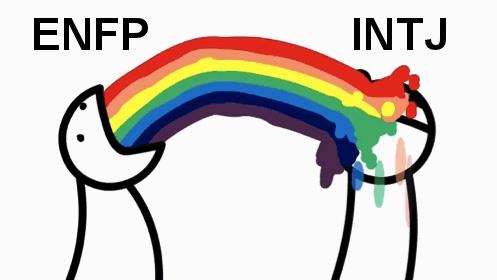
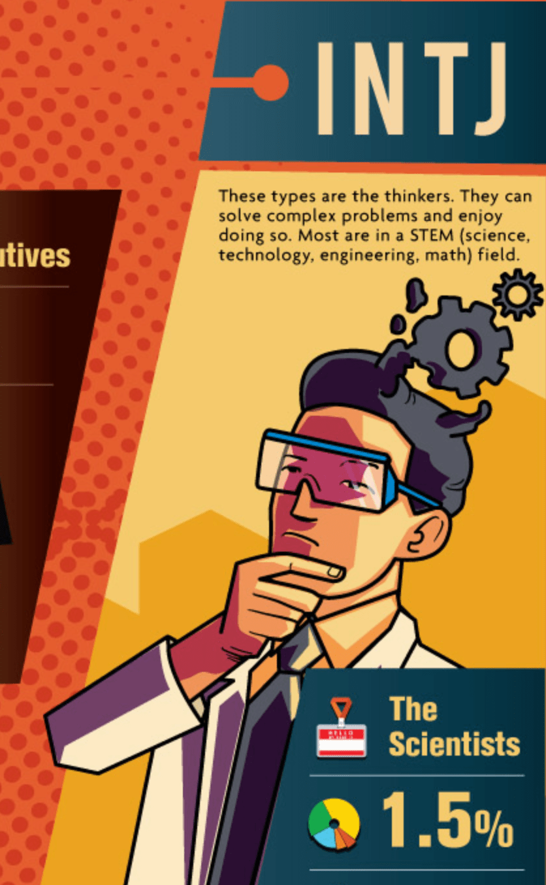

layout: clean
-------------

看不懂这张图？先别着急

# 年轻人的「个人简介」一栏写了什么？
标签，多个标签

用几个标签来标注自己，是年轻人中流行的做法（斜杠青年）。我看到过其中一个标签，由四个字母组成，就好奇查了查，原来是 MBTI 的一种性格类型，并由此产生了这个点子。

# 简单直白，还蛮准
四个字母，ESTJ、INFP，够酷够简单。我也测了一下，感觉蛮准的，比星座靠谱多了。星座都有那么多人信，而且成为经久不衰的话题，性格标签没准也能行。

# 少年，秀出你的四个字母！
玩法是这样的：打开一个微信 H5，花一分钟时间选几个 ABC，就能大概判断出你的职业性格类型，然后生成类似下面这么一张图：

骄傲地向世界大声宣布：I am INTJ

拽拽的有没有？分享到朋友圈，就能立刻享有更全面的性格测试！得到的分析结果当然也更准确。

# 然后呢？
一张美好的职业蓝图摆在面前，当然会有去实现它的冲动。可究竟从哪开始呢？别担心同学，关注我们的性格测评职业规划公众号，有丰富的知识内容和资深专家帮你出谋划策。做到一定的用户规模后，就可以往智课的业务导流。

# Why MBTI?
* 受众广，群众基础好，所以比较容易流行传播
* 与职业选择高度相关，容易与我们的留学业务衔接

# 执行要点
* 题目要轻量：开始做的测试题一定要少，总时长不超过一分钟
* 目的是分享：分享图片的画风要亲和年轻人，愿意秀到朋友圈

# 让你认为自己很理性的，恰恰是你的感性
做职业性格分析，看起来非常追求客观和理性，但依然要用感性的视觉冲击才能打动人。

有几张图，大家感受一下：
* [Best Jobs for your Personality](picture-long-post.html)
* [Are you on the right career path?](picture-career-path.html)
* [每种性格的关键字画像](picture-all-16.html)

如果你看了这些却并没有被打动，说明它很可能不是一个好点子。那么就尽管说出来，它会帮助我们快速试错、及时止损。

另外还做了个小 demo，效果如下：

<iframe style="height: 850px" src="smart.html" frameborder="0" width="100%"></iframe>

也可以[点此链接](smart.html)在单独页面查看 demo。
